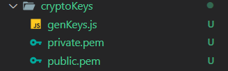
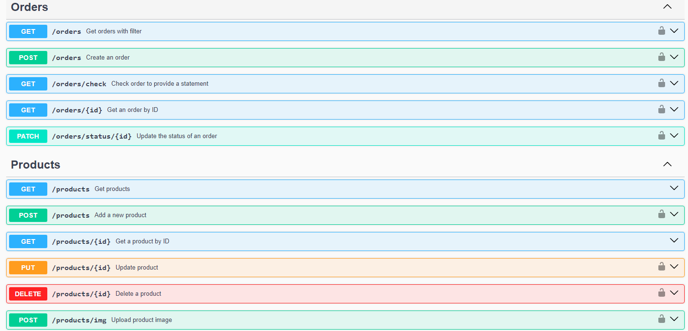

# E-Commerce API Backend Project

This project aims to provide the most commonly used api endpoints for an e-commerce application such as _authentication_, _products_, _discounts_ and _coupons system_.

## Table of Content

- [Overview](#overview)
- [Setup](#setup)
- [APIs](#apis)
- [Documentation](#documentation)
- [Features](#features)

## Overview

This is project is part of my training in [**Re:Coded**](https://www.re-coded.com/) for the backend module.

It is built using **Express JS** and **MongoDB**, with the authentication system manually coded using **jsonwebtoken** to provide authentication interface for mobile apps.

Project designed using **MVC** pattern **Model**, **Controller** and **View**, in which _Views_ are omitted to be included on another project.

## Setup

### Install dependencies

`npm install`

### Generate Public & Private Keys

The project also utilizing **Private** and **Public** keys for encryption, for that a script included in `config/cryptoKeys/genKeys.js`, to execute the script:

`node ./config/cryptoKeys/genKeys.js`

This will result in 2 keys in the same folder.



### Create `.env` File

```js
DB_URL=
MAPBOX_PUBLIC_KEY=
STORE_LNG=
STORE_LAT=
IQD_PER_KM=
```

## APIs

We utilize [**Mapbox API**](https://www.mapbox.com/) to provide accurate estimation of distance and Estimated Time to deliver packages.

We are planning to include [**Twilio API**](https://www.twilio.com/en-us) to provide OTP for more authentication security.

## Documentation

The application endpoints are well documented using [**swagger-jsdoc**](https://www.npmjs.com/package/swagger-jsdoc) and [**swagger-ui-express**](https://www.npmjs.com/package/swagger-ui-express).

You can find and test API endpoints on the following endpoint `/api-docs`.



## Features

The project is inspired by real-life application and problems.

- Multiple roles: `user`, `delivery man`, `manager` and `admin`.
- Fully fledged authentication endpoints for `login` and `signup`.
- Full control on `Products` with ability to track the profits and apply `discounts`.
- Measuring user `distance` and `estimated time of delivery` using Mapbox API.
- Flexible `Cart` with validation of content and making sure there are enough `products` in the `inventory`
- Precisely calculation `orders cost` with `discounts`, `coupons` and `delivery price` according to user location.
